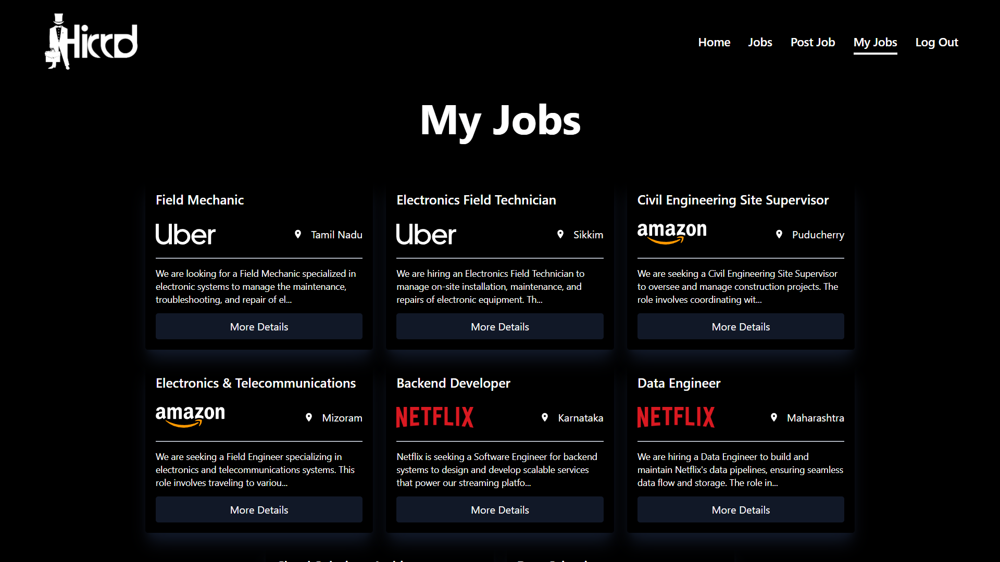
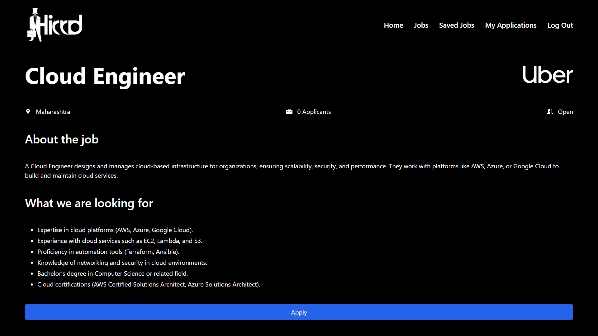

# Hirrd
Hirrd is a full-stack job portal that connects recruiters with candidates, allowing recruiters to hire and candidates to apply for jobs. It streamlines the recruitment process, making it easier for both parties to find the right opportunities.
# Live Demo
A live demo of the application is hosted at [https://job-portal-lhzj.onrender.com](https://job-portal-lhzj.onrender.com)


# Built With
- [Vite](https://vitejs.dev/) - A fast build tool and development server for modern web projects.
- [React](https://reactjs.org/) - A JavaScript library for building user interfaces.
- [Node.js](https://nodejs.org/) - A JavaScript runtime built on Chrome's V8 JavaScript engine.
- [Express.js](https://expressjs.com/) - A web application framework for Node.js designed for building APIs.
- [MongoDB](https://www.mongodb.com/) - A NoSQL database for modern applications.
- [Tailwind CSS](https://tailwindcss.com/) - A utility-first CSS framework for creating custom designs.
- [Shadcn UI](https://shadcn.dev/) - A set of reusable components built using Radix and Tailwind CSS for building modern UIs.

# Run Locally
To run this project locally, follow these steps:

1. Clone the repository:
   ```bash
   git clone https://github.com/Swanand12/Job-Portal.git

2. Navigate to the project directory:
   ```bash
   cd Job-Portal

3. Go to the server directory:
   ```bash
   cd server

4. Install server dependencies and Run the server:
   ```bash
   npm install
   npm run server

5. Go to the client directory:
   ```bash
   cd client

6. Install client dependencies and Run the App:
   ```bash
   npm install
   npm run dev

# Features
## Recruiter Authentication


## All Jobs

## Filter Jobs

## Recruiters can Create Job Postings and Register New Companies.


## Recruiters Job Details.
Recruiters can see job details for their listings, track applications, modify application stages (e.g., "applied" to "interviewing"), update the job’s hiring status (open or closed), and download applicant resumes.
### View Job Details

### Track Applications

### Modify Application Status

### Update Hiring Status


## Recruiter can View the List of Jobs they have Posted.


## Candidates can save jobs for later review and unsave them when needed

## Candidate Job Details
Candidates can view job details and apply by completing the application form.
### View Job Details

### Apply for Job

## Candidates can View the List of Jobs they have Saved.

## Candidates can view the List of Applications they have Submitted.

